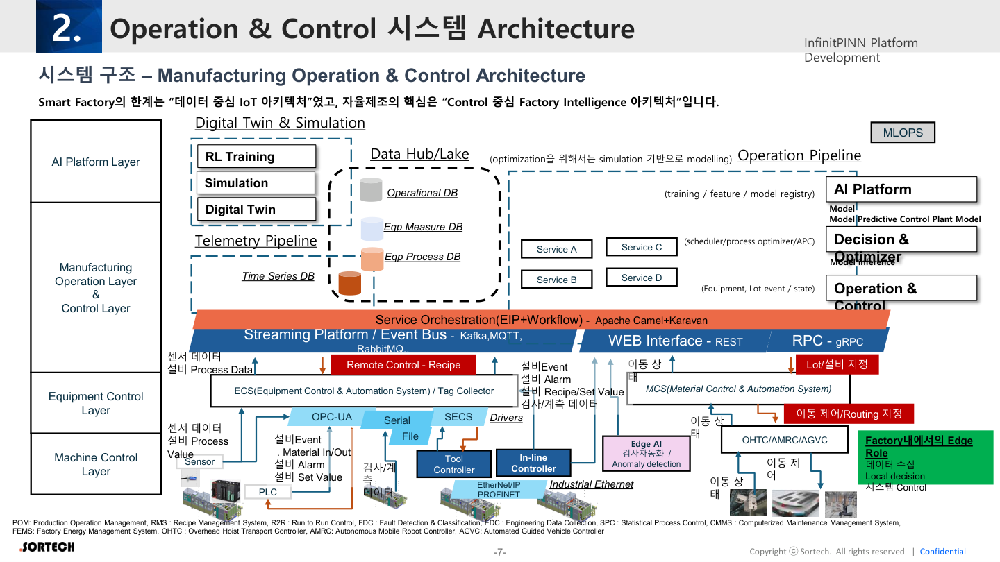
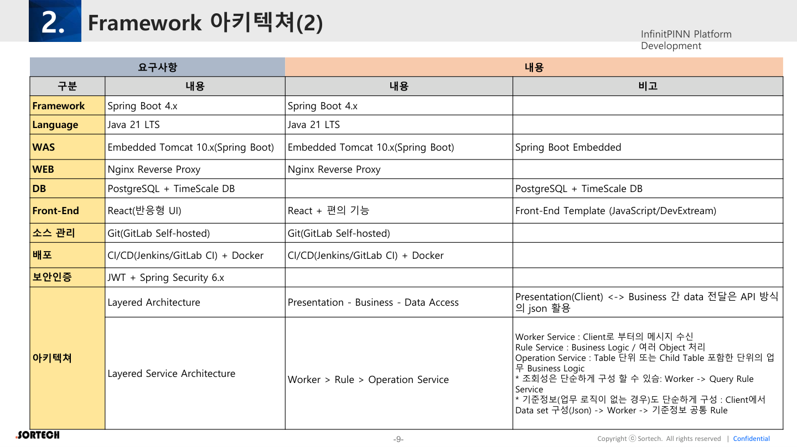

# 02. 시스템·Framework 아키텍처

원본: InfinitPINN Framework v0.2 p.7–9

---

## 2.1 Manufacturing Operation & Control Architecture



### 설계 철학

> Smart Factory의 한계는 **“데이터 중심 IoT 아키텍처”**였고,  
> 자율제조의 핵심은 **“Control 중심 Factory Intelligence 아키텍처”**이다.

### 레이어 구조

| Layer | 역할 | 구성 예시 |
|-------|------|-----------|
| **Equipment Control** | 설비·물류 제어 | ECS, Tag Collector, Tool Controller, PLC, OHTC/AMRC/AGVC, OPC-UA, SECS, EtherNet/IP, PROFINET |
| **Machine Control** | 머신/인라인 제어 | In-line Controller, Drivers |
| **Manufacturing Operation & Control** | 운영·제어 서비스 | POM, RMS, R2R, FDC, EDC, SPC, CMMS, FEMS 등 서비스(A/B/C/D) |
| **AI Platform** | 학습·추론·최적화 | Decision & Optimizer, Model Registry, MPC Plant Model, RL Training, MLOps, Edge AI |
| **Digital Twin & Simulation** | 시뮬·트윈 | Digital Twin, Simulation, Time Series DB |
| **Data** | 저장·허브 | Operational DB, Data Hub/Lake, Eqp Measure/Process DB |

### Edge Role (Factory 내)

1. 데이터 수집  
2. Local decision  
3. 시스템 Control  

### 파이프라인

| Pipeline | 내용 |
|----------|------|
| Telemetry | Sensor, Process Value, Serial, 검사/계측, Event/Alarm |
| Operation | Lot/설비 지정, Material In/Out, Recipe/Set Value, Remote Control |
| Event Bus | Kafka, MQTT, RabbitMQ 등 Streaming Platform |

### 서비스 오케스트레이션

- WEB Interface: **REST**
- RPC: **gRPC**
- Orchestration: **Apache Camel + Karavan** (EIP + Workflow)

### 약어 (원본)

| 약어 | 의미 |
|------|------|
| POM | Production Operation Management |
| RMS | Recipe Management System |
| R2R | Run to Run Control |
| FDC | Fault Detection & Classification |
| EDC | Engineering Data Collection |
| SPC | Statistical Process Control |
| CMMS | Computerized Maintenance Management System |
| FEMS | Factory Energy Management System |
| OHTC | Overhead Hoist Transport Controller |
| AMRC | Autonomous Mobile Robot Controller |
| AGVC | Automated Guided Vehicle Controller |
| MCS | Material Control & Automation System |
| ECS | Equipment Control & Automation System |
| MICC | (관제센터 — 요구사항편) |
| DTAA | (자산·기준정보 — 요구사항편) |
| MIAM | (권한관리 — 감사편) |

---

## 2.2 Framework 아키텍처 (응용 계층)


### Front-End

- 웹 표준·다양한 접근
- **반응형 Web UI**
- 동적 UI 구성: **메타데이터 기반 / 템플릿 기반**
- 표준화·생산성·Hot Fix 대응

### Back-End (Business Application)

공통 모듈 예시:

- 사용자 관리 / 권한 그룹 / 메뉴 관리
- 사용자 세션 / 디바이스
- 시스템 로그 / 프로그램 사용 로그
- 공지사항 / 공통코드 / 패스워드
- 업무 모듈 MOD A / B / C …

### 인프라 구성 요소

```
Client → Nginx Reverse Proxy → Spring Boot Embedded WAS
                ↓
         REST API / JWT
                ↓
    Cache(Redis, Caffeine) · Scheduling · Data Access(JPA/JDBC/QueryDSL)
                ↓
         Multi-DB (JDBC/JPA) · PostgreSQL + TimescaleDB
```

- SCM: GitHub/GitLab
- CI/CD: Jenkins
- Logging: Logback, Log4j2
- Config: YAML (Dev/Prod)

---

## 2.3 기술 스택 확정표



| 구분 | 내용 |
|------|------|
| Framework | Spring Boot **4.x** |
| Language | **Java 21 LTS** |
| WAS | Embedded Tomcat **10.x** |
| WEB | Nginx Reverse Proxy |
| DB | **PostgreSQL + TimescaleDB** |
| Front-End | **React** (반응형) + 편의기능 / Template (JS/DevExtreme) |
| 소스관리 | Git (GitLab Self-hosted) |
| 배포 | CI/CD (Jenkins/GitLab CI) + Docker |
| 보안인증 | **JWT + Spring Security 6.x** |
| 아키텍처 | Layered Architecture |

### Presentation ↔ Business

- Client ↔ Business 간 데이터는 **API + JSON**

### Layered Service Architecture

```
Worker  →  Rule  →  Operation Service
```

| Layer | 역할 |
|-------|------|
| **Worker Service** | Client 메시지 수신 |
| **Rule Service** | Business Logic / 다수 Object 처리 |
| **Operation Service** | Table 단위 또는 Child Table 포함 단위의 업무 Logic |

#### 단순화 패턴

| 시나리오 | 흐름 |
|----------|------|
| 조회성 | Worker → Query Rule Service |
| 기준정보 (로직 없음) | Client가 Data set(JSON) 구성 → Worker → 기준정보 공통 Rule |

---

## 아키텍처 시사점 (분석)

1. **Control-first**: UI도 “모니터링만”이 아니라 승인·제어·Sim-to-Real이 1급 UX.
2. **MSA + Camel**: 서비스 간 오케스트레이션이 표준 → FE는 deep link·trace_id 추적 UI 필요.
3. **메타데이터 UI**: 동적/템플릿 기반 → FE Design System + 메타 스키마 정합이 중요.
4. **TimescaleDB**: 시계열·설비 데이터 → Command Center·트렌드 화면 설계 근거.
5. **Worker/Rule/Operation**: API·에러 메시지·감사 로그의 경계가 레이어와 일치해야 함.
