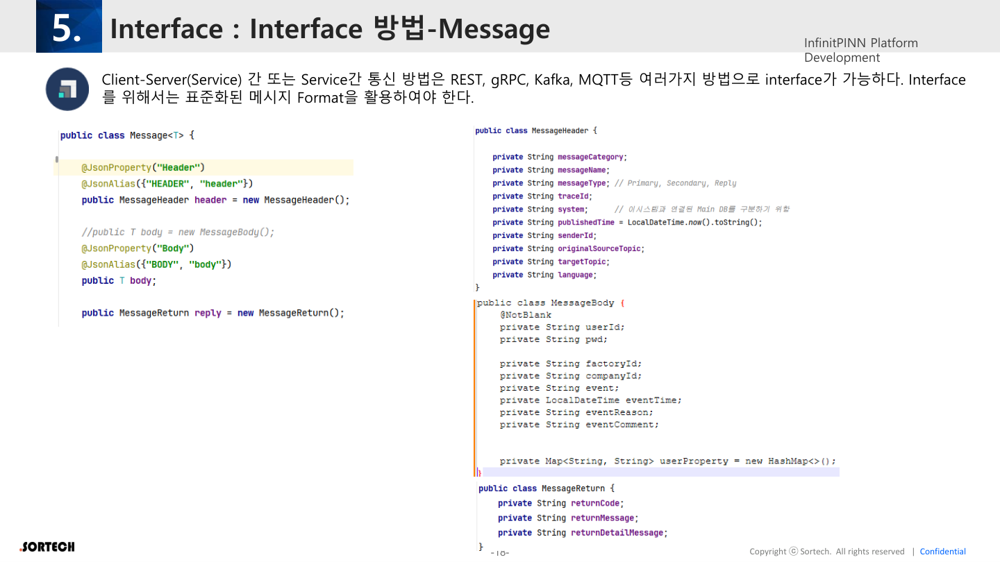

# 05. Interface (메시지 연동)

원본: InfinitPINN Framework v0.2 p.18–19

---

## 5.1 통신 수단

Client↔Server 또는 Service↔Service 통신은 다음을 지원한다.

| 방식 | 메시지 형태 | 비고 |
|------|-------------|------|
| **REST** | JSON | WEB / FE 주력 |
| **gRPC** | Protobuf (`.proto` 필수) | 서비스 간·AI 연동 고성능 |
| **Kafka** | JSON (헤더에 traceId 등) | 이벤트·비동기·로그 |
| **MQTT** | JSON | Edge/IoT |

공통 전제: **표준화된 Message Format** 필수.

---

## 5.2 메시지·코드 생성

| 프로토콜 | 스키마 | Java 대응 |
|----------|--------|-----------|
| gRPC | `.proto` 파일 필수 | Generated stub/class |
| REST / Kafka / MQTT | JSON | 대응 Java message class |

- 설계서 기반 **자동 generate (Python)** 언급
- Common Message + Service별 Message 분리

### 개념 구성 (원본)

- Json message example  
- proto example: Service  
- Message (common)  
- proto Message 예제  
- Generated code → Java message class  

> 원본 PPT의 구체 JSON/proto 샘플은 이미지·도식 중심이라, 본 MD에서는 규약만 문서화. 샘플 스키마는 후속 설계서에서 보강 권장.

---

## 5.3 Framework와의 연결

| 인입 | Handler |
|------|---------|
| HTTP/REST | `AmsTidFilter`, `AmsContextFilter`, `GlobalExceptionHandler` |
| gRPC | `AmsGrpcInterceptor`, `GrpcGlobalExceptionHandler` |
| Kafka | `AmsKafkaInterceptor`, `KafkaGlobalExceptionHandler` |

모든 경로에서 **`trace_id` 전파**가 공통 규칙.

라우팅: `WorkerRouter` → `MessageWorker` → Rule / Operation

응답 패킹: `MessageResultHandler` → `{ Result, Message, Data }`

---

## 5.4 Interface 설계 체크리스트

- [ ] Common 헤더 필드: `trace_id`, `senderId`, `factoryId`, `lang`, 시각, 커맨드/타입
- [ ] REST OpenAPI / gRPC proto / Kafka topic·스키마 레지스트리 정렬
- [ ] 에러코드 ↔ NLS 메시지 키 매핑표
- [ ] DLQ 정책 (Kafka)
- [ ] Edge MQTT QoS·재시도·오프라인 버퍼 정책
- [ ] AI(gRPC) 호출 타임아웃·승인(Sim-to-Real) 메시지 분리

---

## Interface 시사점 (분석)

1. FE는 REST JSON이 주력이지만, **제어·AI는 gRPC/이벤트**일 수 있음 → UI는 “요청 상태/승인 대기” 표현 필요.
2. 메시지 자동생성 파이프라인이 있으므로 FE 타입(TypeScript)도 **동일 설계서에서 generate**하면 정합성이 올라감.
3. `WorkerRouter` 커맨드 카탈로그가 사실상 **API 목록** — FE 메뉴/액션 Permission과 1:1 매핑 후보.
