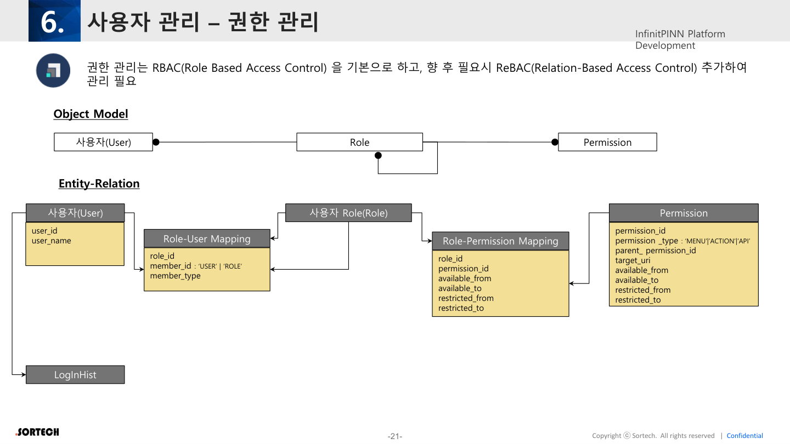

# 06. 사용자 및 권한 관리

원본: InfinitPINN Framework v0.2 p.20–23



---

## 6.1 Authentication vs Authorization

| 개념 | 의미 | InfinitPINN에서의 위치 |
|------|------|------------------------|
| **Authentication** | 누구인가 | Login/JWT, LoginHist, Password |
| **Authorization** | 무엇을 할 수 있는가 | Role, Permission, 런타임 Check |

보안 인증 스택: **JWT + Spring Security 6.x**

---

## 6.2 RBAC 객체 모델

기본: **RBAC (Role-Based Access Control)**  
향후 필요 시: **ReBAC (Relation-Based Access Control)** 추가

### 엔티티 관계

```
User ──< Role-User Mapping >── Role ──< Role-Permission Mapping >── Permission
                │
                └── member_type: 'USER' | 'ROLE'   (Role이 Role에 속할 수 있음)
```

### User

| 필드 | 설명 |
|------|------|
| `user_id` | 사용자 ID |
| `user_name` | 사용자명 |
| (+ LoginHist) | 로그인 이력 |

### Role

- 권한 그룹
- User 또는 다른 Role을 멤버로 가질 수 있음

### Role–User Mapping

| 필드 | 설명 |
|------|------|
| `role_id` | Role |
| `member_id` | User 또는 Role ID |
| `member_type` | `'USER'` \| `'ROLE'` |

### Permission

| 필드 | 설명 |
|------|------|
| `permission_id` | 권한 ID |
| `permission_type` | `'MENU'` \| `'ACTION'` \| `'API'` |
| `parent_permission_id` | 계층 |
| `target_uri` | 대상 URI/리소스 |
| `available_from` / `available_to` | 유효 기간 |
| `restricted_from` / `restricted_to` | 제한 기간 |

### Role–Permission Mapping

| 필드 | 설명 |
|------|------|
| `role_id` | Role |
| `permission_id` | Permission |
| `available_from` / `available_to` | 유효 기간 |
| `restricted_from` / `restricted_to` | 제한 기간 |

### Permission 유형과 UI 매핑

| type | UI/시스템 의미 |
|------|----------------|
| MENU | 메뉴·화면 진입 |
| ACTION | 버튼·제어 액션 (승인, 실행 등) |
| API | 백엔드 API 호출 |

→ FE는 메뉴 숨김만이 아니라 **버튼 단위(ACTION)** 비활성/숨김이 필요.

---

## 6.3 암호화 방식 비교

| 비교 | AES-256 | SHA-256 |
|------|---------|---------|
| 성격 | 양방향 암호화 | 단방향 해시 |
| 복호화 | 키로 가능 | **불가** |
| 용도 | 계좌·주민·전화·이메일 등 재열람 필요 데이터 | **사용자 비밀번호** |

> 정책: 사용자 비밀번호는 **SHA-256** 사용.  
> (실무에서는 SHA-256 단독보다 salted hash / bcrypt·argon2 검토가 일반적이나, **원본 문서 명시는 SHA-256**.)

---

## 6.4 Password Policy (상수 테이블)

설정은 코드 하드코딩이 아니라 DB 상수로 관리.

### Tables

- `com_constant_class` — `class_id = 'PWD_POLICY'`
- `com_constant_definition` — 정책 상세

### 정의값

| definition_code | value (예시) | 설명 |
|-----------------|--------------|------|
| `MIN_LEN` | `9` | 최소 길이 |
| `CHANGE_CYCLE` | `90` | 변경 주기(일) |
| `USE_REGEX` | `TRUE` | 정규식 검증 여부 |
| `REGEX_PATTERN` | `^(?=.*[A-Za-z])(?=.*\d)(?=.*[~!@#$%^&*]).+$` | 영문+숫자+특수문자 |
| `REGEX_MSG` | 비밀번호는 영문, 숫자, 특수문자를 조합해야 합니다. | 사용자 안내 |

---

## 6.5 요구사항과의 갭

| 요구 (01장) | 권한 모델 반영 | 상태 |
|-------------|---------------|------|
| Menu/Action/API Permission | `permission_type`으로 반영 | 확정 |
| Role 계층 | `member_type=ROLE` | 확정 |
| AI Agent 호출·Sim-to-Real 승인 | 별도 Permission 설계 필요 | **T.B.D** |
| 데이터 반출·MIM 기여 | Data Governance Role | **T.B.D** |
| 기간형 권한 | available/restricted 필드 | 모델 반영됨 |

---

## 권한 UX 시사점 (분석)

1. **S01 포털**은 Role별 타일/앱 노출이 곧 Permission(MENU).
2. **S04/S07/S09**의 Primary 버튼은 ACTION Permission.
3. AI 제어 승인은 일반 ACTION과 분리된 **고위험 승인 UX**(2차 확인·사유 입력)가 맞음.
4. Password Policy는 FE 회원가입/변경 폼이 **서버 상수 API**를 읽어 표시해야 메시지 불일치 방지.
5. available/restricted 기간 → “권한 만료 예정” 알림 UX 후보.
