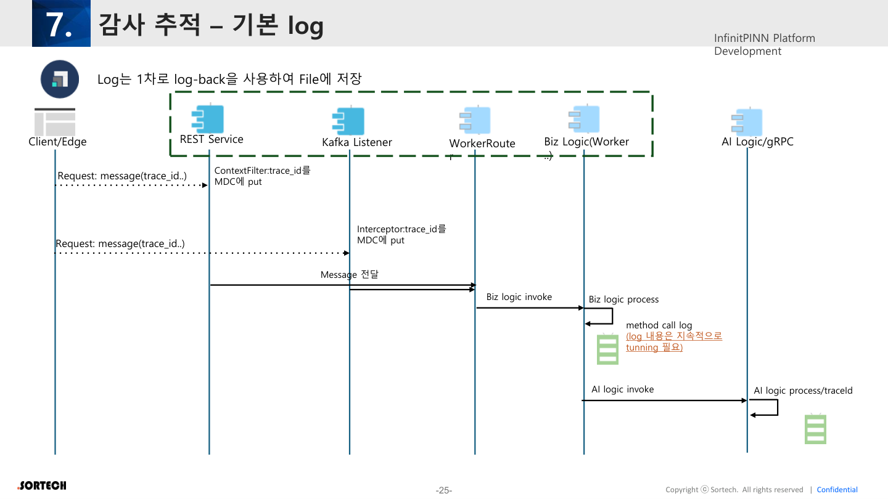
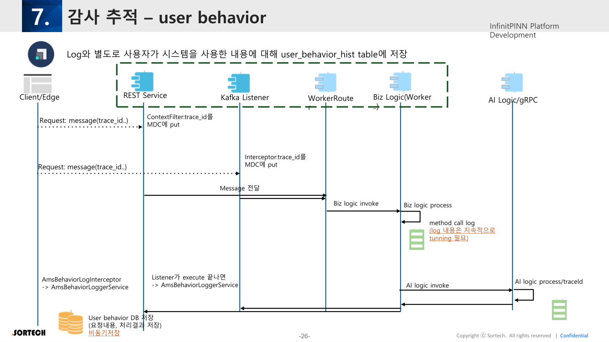
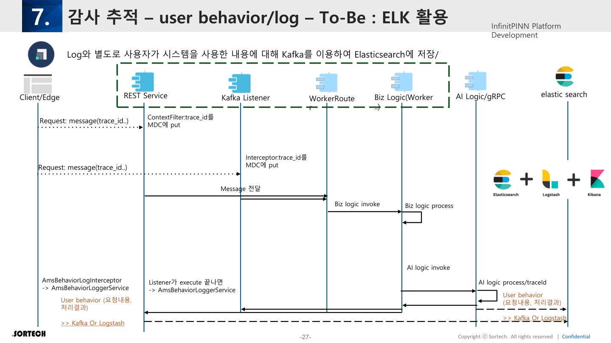

# 07. 감사추적 (Audit Trail)

원본: InfinitPINN Framework v0.2 p.24–27

---

## 7.1 기본 원칙

1. **일반 시스템 로그**와 **감사추적용 로그**를 분리한다.
2. 요청 cycle에 **`trace_id`**를 부여해 전 구간을 추적한다.
3. MSA/컨테이너 환경에서는 프로세스·Pod·Container 수만큼 로그 파일이 생길 수 있음을 전제한다. (K8S/Docker)

---

## 7.2 기본 Log (As-Is)



### 흐름

```
Client/Edge
   │  Request(+trace_id)
   ▼
REST: ContextFilter → MDC.put(trace_id)
Kafka: Interceptor → MDC.put(trace_id)
   ▼
WorkerRouter → Biz Logic (Worker …)
   │              │
   │              └─ method call log (지속 tunning)
   ▼
AI Logic / gRPC  (동일 traceId 전파)
```

- 1차 저장: **Logback → File**
- 로그 내용은 지속적으로 튜닝

---

## 7.3 User Behavior Hist



일반 로그와 별도로, 사용자 시스템 사용 내용을 **`user_behavior_hist`** 테이블에 저장.

| 항목 | 내용 |
|------|------|
| 저장 내용 | 요청 내용, 처리 결과 |
| 저장 방식 | **비동기** (업무 TX와 분리) |
| REST 경로 | `AmsBehaviorLogInterceptor` → `AmsBehaviorLoggerService` |
| Kafka 경로 | Listener execute 종료 후 → `AmsBehaviorLoggerService` |

```
… Biz Logic invoke
        │
        ▼
User behavior DB 저장 (요청·결과)  ← 비동기
```

---

## 7.4 To-Be: ELK 활용



User behavior(및 로그)를 Kafka(또는 Logstash)를 거쳐 **Elasticsearch**에 적재.

```
AmsBehaviorLoggerService
        │
        ▼
Kafka / Logstash ──► Elasticsearch
        ▲
AI Logic/gRPC behavior도 동일 파이프
```

요구사항(01장)과 정합:

- Zero-latency: 앱 → Kafka 비동기
- MICC에서 Trace ID 기준 타임라인 조회
- AI Explainable Log / Control Trail / Acknowledge Log는 **감사 저장 항목 카탈로그**로 별도 정의 필요

---

## 7.5 감사 데이터 카탈로그 (권장 정리안)

원본: “각 업무별로 저장이 필요한 항목은 별도 정리 필요” → 초안 체크리스트

| 카테고리 | 예시 필드 | 비고 |
|----------|-----------|------|
| 공통 | trace_id, user_id, factory_id, timestamp, channel(REST/Kafka/gRPC) | 필수 |
| 요청 | command/type, URI/topic, payload summary | 민감필드 마스킹 |
| 결과 | result_code, message_key, duration_ms | NLS 키 |
| AI | model_id, input snapshot ref, score, rationale | XAI |
| Control | equipment_id, setpoints, approve_user, approve_ts | Sim-to-Real |
| Ack | plc_ack, edge_ack, roundtrip_ms, final_state | 현장 반영 |

---

## 감사추적 시사점 (분석)

1. FE **MICC/사후분석** 화면은 Trace ID 검색 → 타임라인 조립이 UX 핵심 (S02/S12).
2. Behavior 로그는 비동기이므로 UI “저장 완료”와 감사 기록 시점 불일치 가능 → 안내 문구 고려.
3. AI 제어는 Compliance 수준 → 승인 모달에 **사유·스냅샷 요약** 표시가 감사와 동일 언어여야 함.
4. Pod 단위 파일 로그는 운영에서 유실·분산 → **ELK To-Be를 조기 전제**하는 편이 안전.
