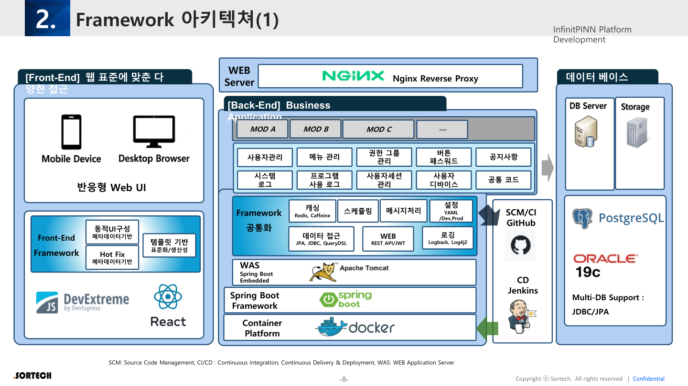

# 01. Web Framework

InfinitPINN **Web Framework** — 브라우저 기반 제조 Operation·관제·관리 콘솔의 근간.

원본 매핑: Framework 아키텍처(p.8–9), platform 공통(p.12), Auth(p.20–23), Audit UI 연동(p.6, 24–27)

---

## 1. 제품 정의

| 항목 | 내용 |
|------|------|
| 목적 | 역할 기반 Web UI + REST API로 공장 운영·설정·승인·감사를 수행 |
| 클라이언트 | 반응형 Web (React), 메타데이터/템플릿 기반 동적 UI |
| 서버 | Spring Boot Embedded + Nginx, JWT |
| 포지션 | 3종 중 **UX·권한·기준정보의 허브**. Edge/SPC 결과의 가시화·승인 창구 |

---

## 2. 범위 (In / Out)

### In Scope
- 반응형 Web UI, 동적·템플릿 UI
- 사용자·Role·Permission(MENU/ACTION/API)·세션·디바이스
- 메뉴/모듈: 관제(MICC), 자산·기준정보(DTAA), 시스템 설정·운영, 공지·공통코드
- REST API, 표준 응답(`Result/Message/Data`)
- Query 기반 화면 조회, 기준정보 CRUD
- 로그인·Password Policy·Login Hist
- 감사 조회·MICC 사후분석 화면 (ELK/Trace 연동 To-Be)
- AI 제안의 **사람 승인(Sim-to-Real)** UI (요구사항, Agent 권한은 TBD)

### Out of Scope (다른 Framework)
- PLC/드라이버 직결, 로컬 실시간 제어 루프 → **Edge**
- 관리도 엔진·SPC 룰 계산 코어 → **SPC** (UI는 Web에 임베드 가능)

---

## 3. 아키텍처 슬롯



```
Browser (React)
    → Nginx Reverse Proxy
        → Spring Boot WAS (REST/JWT)
            → Worker → Rule → Operation
            → JPA/QueryDSL/JDBC → PostgreSQL(+Timescale)
            → Redis/Caffeine
            → Kafka (이벤트 구독/발행)
```

| FE 키워드 (원본) | 의미 |
|------------------|------|
| 웹 표준·다양한 접근 | 멀티 디바이스 |
| 메타데이터 기반 | 동적 화면 구성 |
| 템플릿 기반 | 표준화·생산성·Hot Fix |
| DevExtreme 등 | 그리드/차트 편의 |

---

## 4. 핵심 기능 맵

| 기능 영역 | 원본 근거 | Web FW 구현 포인트 |
|-----------|-----------|-------------------|
| AuthN/AuthZ | JWT, RBAC, Permission type | 메뉴 가시성 + 버튼(ACTION) + API 가드 |
| 포털 | MICC/DTAA/설정 모듈 | Role별 Launchpad |
| 기준정보 | platform query/CRUD | 그리드·Object 상세·Hist |
| 메시지 | REST JSON | OpenAPI + generate TS |
| 다국어 | NLS MessageProvider | UI 카피·에러 키화 |
| 관제 | MICC, Observability | KPI·알람·Trace 타임라인 |
| 승인 | MIAM, Control Trail | AI/제어 승인·반려·사유 |
| 감사 | user_behavior_hist | 사용이력·요청/결과 조회 |

---

## 5. Permission ↔ UI

| `permission_type` | Web 적용 |
|-------------------|----------|
| MENU | 사이드/포털 진입 |
| ACTION | 실행·저장·승인·다운로드 등 버튼 |
| API | FE 직접 호출 API 및 BFF |

기간형 권한(`available_*` / `restricted_*`) → “권한 만료” 배너·비활성.

---

## 6. 화면유형(시안) 우선 매핑

| 시안 ID | Web Framework 연관 |
|---------|-------------------|
| S01 포털 | Role Launchpad, MENU |
| S02 Command Center | MICC |
| S04 Shopfloor* | Web 터미널 모드 (현장 브라우저도 Web FW) |
| S05 그리드 | QueryDSL 화면 API |
| S06 Object | Hist / Extension |
| S09 품질 UI | SPC 결과를 Web에 표시 |
| S12 감사/리포트 | Behavior · ELK |

\*현장 키오스크가 네이티브면 Edge UI 별도. 문서상 Client/Edge는 메시지 주체.

---

## 7. 의존성

```
Web FW ──depends──► AMS Core
Web FW ──subscribes► Edge events (Kafka/MQTT bridge)
Web FW ──embeds────► SPC views / APIs
Web FW ──calls─────► AI (gRPC/REST) + 승인 후 Edge 반영
```

---

## 8. 제작 산출물 체크리스트

- [ ] Design System + 메타 UI 스키마
- [ ] React 앱 셸 (포털·라우팅·권한 가드)
- [ ] Auth (Login, JWT refresh, Password Policy API)
- [ ] 표준 API Client (`Result/Message/Data`, NLS)
- [ ] 기준정보/그리드 템플릿
- [ ] MICC 관제 셸 + Trace 조회
- [ ] Sim-to-Real 승인 플로우 UI
- [ ] user_behavior 연동 확인

상세: [../06-user-auth.md](../06-user-auth.md), [../03-backend-framework.md](../03-backend-framework.md)
